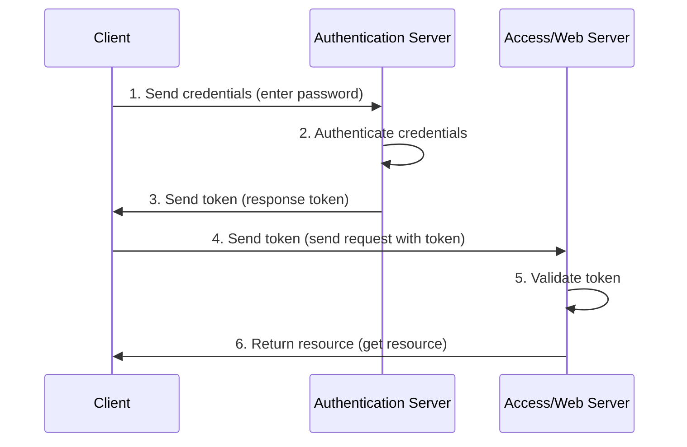
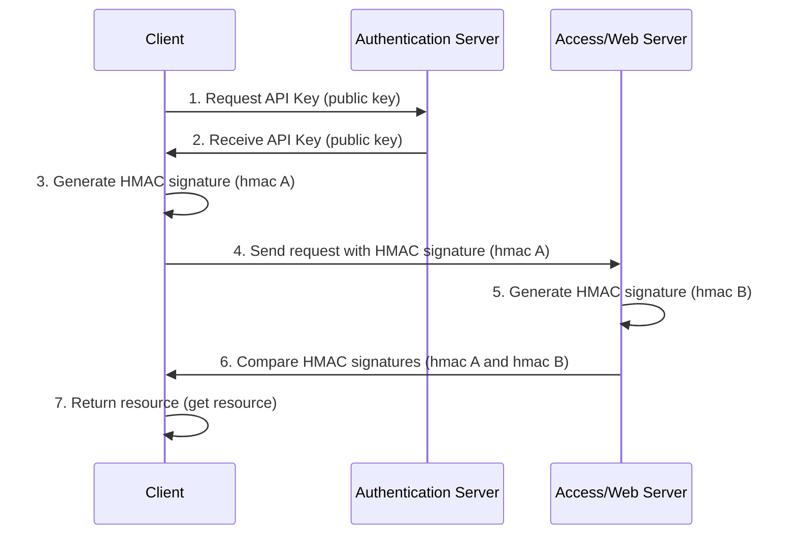

## Token based authentication

-   Step 1 - the user enters their password into the client, and the client sends the password to the Authentication Server.
-   Step 2 - the Authentication Server authenticates the credentials and generates a token with an expiry time.
-   Steps 3 and 4 - now the client can send requests to access/web server resources with the token in the HTTP header. This access is valid until the token expires.

## HMAC based authentication

This mechanism generates a Message Authentication Code (signature) by using a hash function (SHA256 or MD5).

-   Steps 1 and 2 - the server generates two keys, one is Public APP ID (public key) and the other one is API Key (private key).
-   Step 3 - we now generate a HMAC signature on the client side (hmac A). This signature is generated with a set of attributes listed in the diagram.
-   Step 4 - the client sends requests to access/Web server resources with hmac A in the HTTP header.
-   Step 5 - the server receives the request which contains the request data and the authentication header. It extracts the necessary attributes from the request and uses the API key that’s stored on the server side to generate a signature (hmac B.)
-   Steps 6 and 7 - the server compares hmac A (generated on the client side) and hmac B (generated on the server side). If they are matched, the requested resource will be returned to the client.
    Question - How does HMAC authentication ensure data integrity? Why
    do we include “request timestamp” in HMAC signature generation?

